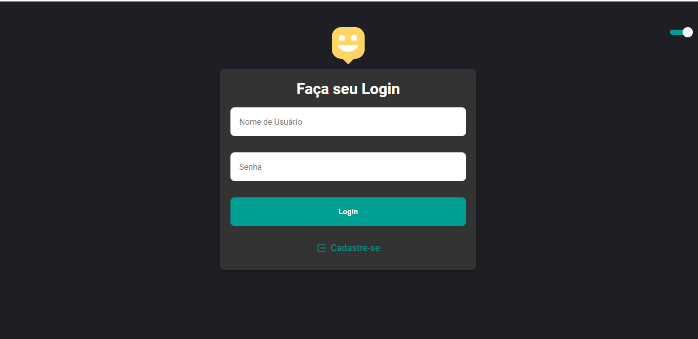
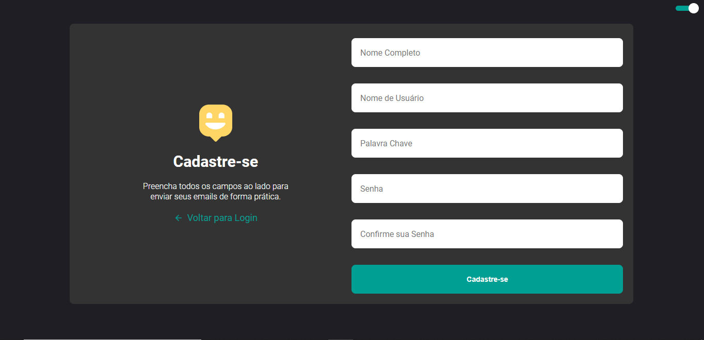
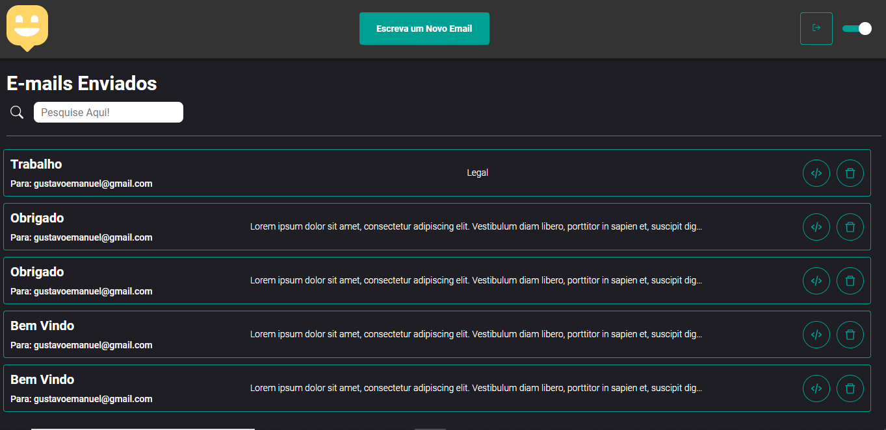
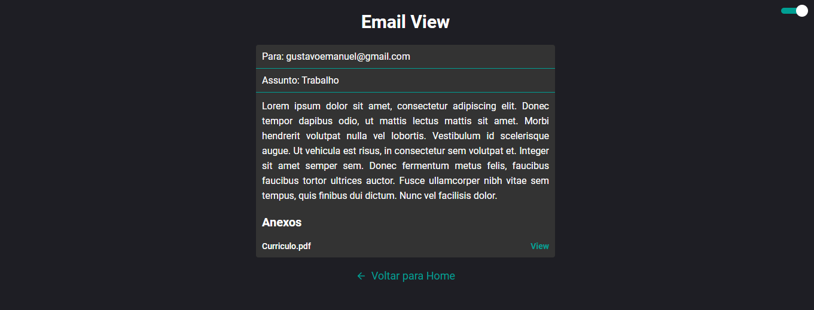
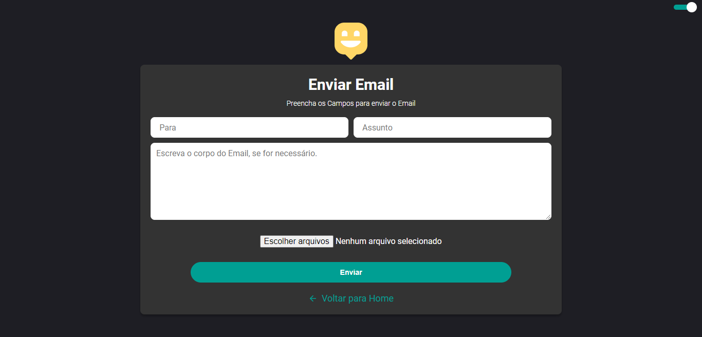

# SendEmail
Aplicação de Envio de Email com React e NodeJs.

## Frontend

- Utiliza React e Typescript
- Styled-Components
- Dark Mode com Context Api
- Consulta de Api com Axios

## Backend

- Api feita com Express
- Eslint
- Sequelize ORM
- PostgreSQL
- Upload de Arquivos para o Amazon S3

